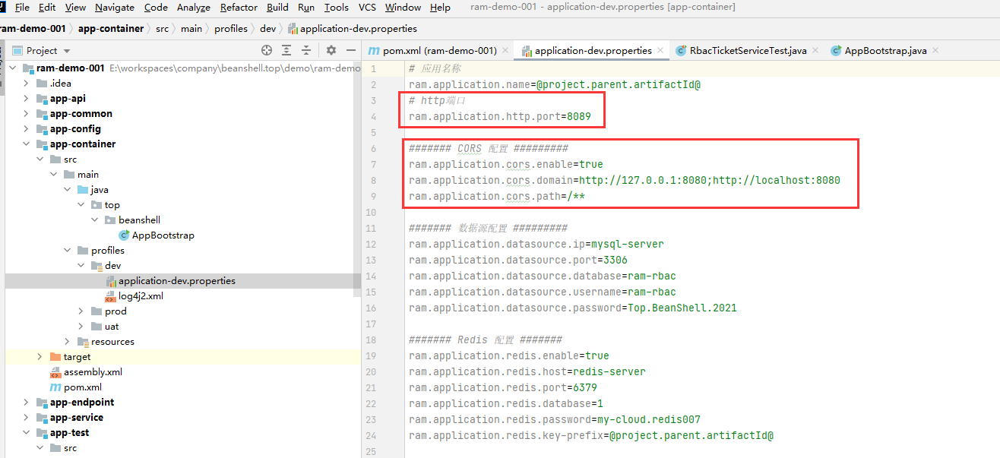
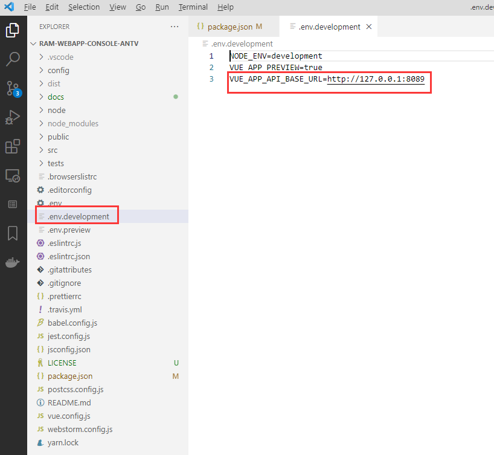
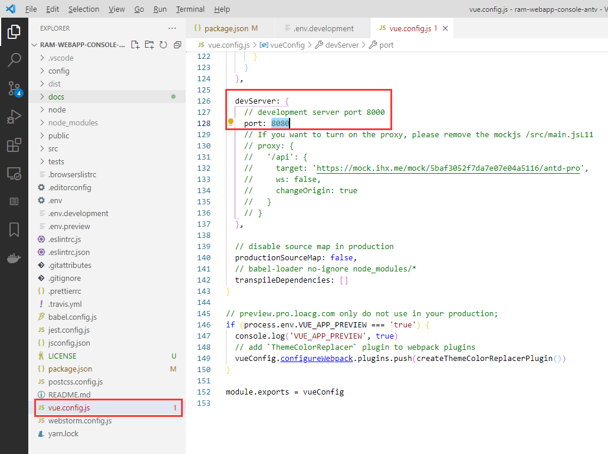

# ram-webapp-console

ram开发框架 管理后台 前端原型 --- ANT-VUE实现

## 如何使用

默认RAM后台工程使用8089 HTTP端口，前端原型工程使用8080端口，不需任何修改即可运行项目。

但是，每个人习惯不一样，可能8080和8089任一端口被占用的情况还是存在的，那么出现这种情况就需要单独配置端口信息了。

### 配置后端HTTP端口

在后端工程的配置文件中，有HTTP端口配置项：



请按需修改后端HTTP端口，然后在前端工程修改后端工程信息：



将BASE_URL的8089端口同步为自定义的端口即可。

### 配置前端HTTP端口

可以在vue.config.js 文件中找到devServer的配置项，如图：



修改端口即可，但修改完前端端口，后端的CORS配置项也许一并更新：


将CORS的domain配置值中的8080改为自定义的端口即可.

### 安装依赖

```bash
yarn install
```

### 运行项目

```bash
yarn run dev
```

### 构建项目

```bash
yarn run build
```
